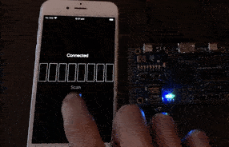
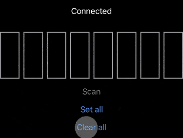

# mobile-fpga-bluetooth-demo

This is a simple interactive Bluetooth (BLE) demo using a mobile app (iOS + SwiftUI), an ESP32 (running MicroPython) and an FPGA (implementing a Verilog design).

The FPGA board used in this demo is the [ULX3S](https://github.com/emard/ulx3s) which contains the ESP32 and FPGA. There are 8 LEDs on the board which can be updated using the buttons on the PCB. The LED display and state transfer is managed by the FPGA.

The ESP32 implements a BLE peripheral which synchronizes the LED state with a custom iOS app. This mobile app can also update the LED states, which it sends to the ESP32 over BLE, which in turn sends it to the FPGA over an SPI interface implemented using GPIO.

This basic project serves as a starting point for other projects that use Bluetooth to control the FPGA.



## Prerequisites

### FPGA and ESP32 (Server)

* [MicroPython](https://github.com/micropython/micropython) must be preinstalled on the ESP32. The [esp32ecp5](https://github.com/emard/esp32ecp5) repo has instructions on setting this up. MicroPython 1.13 is used for this demo.
* [yosys](https://github.com/YosysHQ/yosys)
* [nextpnr-ecp5](https://github.com/YosysHQ/nextpnr)
* [fujprog](https://github.com/kost/fujprog)

### Mobile app (Client)

* Xcode 12.0.0 or newer
* iPhone / iPad running iOS14 or newer

This repo currently includes an iOS project only which makes it harder to build and run on non-macOS platforms. The Bluetooth service is very simple though and implementing a client for different platforms wouldn't take much effort.

## Usage

It's assumed that MicroPython has already been flashed to the ESP32 as mentioned above.

### Flashing FPGA bitstream

The [rtl/](rtl/) directory contains the sources to build the FPGA bitstream. This includes a UART passthrough for the ESP32 for console interaction.

The Makefile must be configured according to the size of the ECP5. Default is 85F.

```
cd rtl
make ulx3s_prog
```

### ESP32 configuration

The files in the [esp32/](esp32/) directory need to be copied to the ESP32. The included main.py file is automatically run by MicroPython on startup. If this isn't wanted, it can be renamed and manually started with an `import` statement in the REPL. When the ESP32 program starts, it should print regular status updates.

* [webrepl](https://github.com/micropython/webrepl) can be used to copy files to upload files remotely.
* [rshell](https://github.com/dhylands/rshell) can be used to upload files over the console.

The ESP32 variant used on the test board is WROOM, which has limited RAM but had no apparent issues running the software.

### Mobile app

Once the FPGA has been configured and the ESP32 is running, the included app in the [iOS/](iOS/) directory can connect to the ESP32 by tapping the "Scan" button.

## Controls

LED states are automatically synced between the FPGA and Mobile when changed on either end.

### FPGA

The PCB buttons can be used to update the LED state using these buttons:

* 1: Decrement
* 2: Increment
* 5: Shift left
* 6: Shift right

### Mobile app

In addition to the onscreen buttons to set / clear all LEDs, they can be individually be toggled by tapping the corresponding LED button on screen.



## Known issues

MicroPython 1.13 has a [minor issue](https://github.com/micropython/micropython/issues/5489) where the BLE setup can sometimes take longer to complete. The worst case seen so far is about 10 secondss so there might be a delay between the ESP32 starting and a BLE scan finding it.

## TODO

* Alternate Bluetooth clients